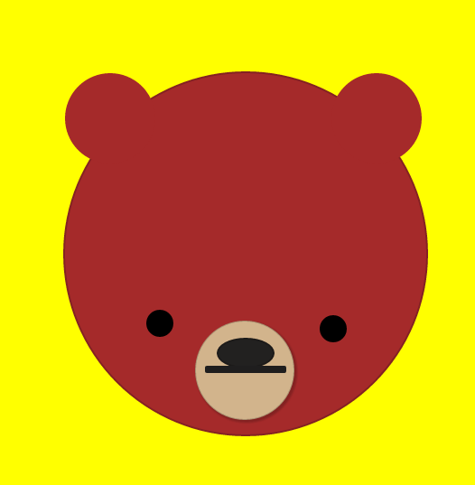
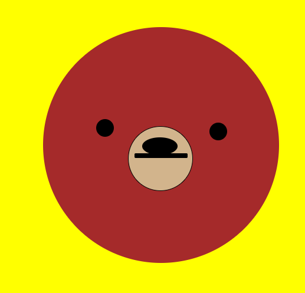
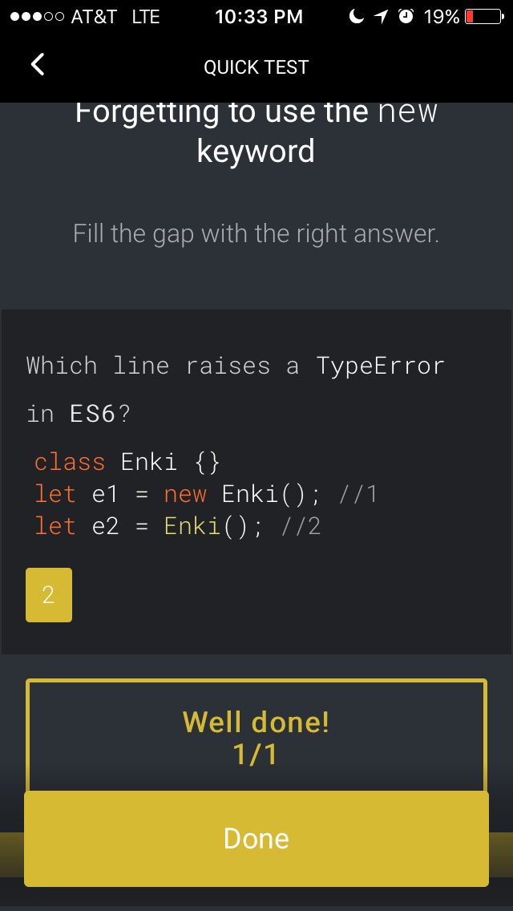

# 100 Days Of Code - Log

##Day 34: February 10, 2017
#### FreeCodeCamp Algorithms: Search and Destroy

**Today's Progress**: Beasted it!

**Thoughts**: See above.

##Day 33: February 8, 2017
#### Postcards for Devs and Aliases

**Today's Progress** Added 3 new git aliases. Configured yeoman to eject from create-react-app. 

**Thoughts**: Might make another "Postcards for Devs" in both Angular and create-react-app just for the heck of it. TODO: Decide whether or not to make the postcard from an image or from CSS (might do it in CSS with Angular just to shake up the skillz a bit). 

**Links**:

##Day 32: February 7, 2017
#### CodeSchool and Angular

**Today's Progress** I mean, directives?

**Thoughts**: Found a lot of bugs in CodeSchool's AngularJS course. Like legit, wouldn't let me pass a module even when the answer was super correct (how did I know it was correct, because I made it give me the answer after I'd hit submit 15x). I learned a bit but I really would have liked to have continued to build something other than a To-Do list. I heard a puppy dies every time someone does a To-Do list as a "learn-to-do-this-thing" app.

**Links**: Eh. 

##Day 31: February 6, 2017
#### Open Code: Career Advice

**Today's Progress**: Recap.

**Thoughts**: Took a few days off so that I could completely immerse myself in helping junior devs in my community get job-ready. There aren't a lot of helpful workshops for junior devs in Orlando (even with two big name bootcamps) to get career advice and learn how to nail those interviews, have gorgeous portfolios, and have clean resumes. 

A ton of really great senior developers, recruiters, and HR reps came to help out the Orlando junior dev community. They gave excellent feedback to all the junior devs that came out and a lot of them said they learned a lot about interviewing another person! It was wonderful to see the senior dev community reach out! 

Shout out to Michael Dupont, Cassie Wilcox, Erin Denton, Casey Faist, Sergio Cruz, Alex Denton, David Khoursid, Jared Porcenaluk, Brian Gates, Austin Musice & Amelia (from Highwinds), Katie Watson & David & Louis (from Kaviliro) for providing your time and mentorship capabilities. <3

**Links**:
- [Why the Pause](https://medium.com/@nellarro/why-i-took-4-days-off-of-100daysofcode-fb588772d03c#.z5i5z7h3y)
- [Open Code: Career Workshop](https://www.meetup.com/Open-Code-Orlando/events/237125903/)

##Day 30: January 31, 2017
#### CSS Tiger

**Today's Progress**: Finished the CSS tiger.

**Thoughts**: Overall, I'm pretty happy about what the tiger looks like. I wish I could have made the border radius on the stripes look a little cleaner. I think I will get that with time. I also don't really enjoy how much code it took to make it because I'm sure I could have done it in less code in Sass.

Planning is pivotal to the success of these kinds of projects.

**Link**: 
[Tiger on CodePen](https://codepen.io/nellarro/pen/apEKeB?editors=0100)

##Day 29: January 30, 2017
#### CSS Tiger

**Today's Progress**: Made updates on the tiger. Now has whiskers and 3 stripes. Will need to more black stripes and 4 white stripes.

**Thoughts**: Spent the better part of today doing some Redux tutorials (but those don't count so I can't put them here as proof that I actually coded for the day so I worked on CSS Tiger). I think when you're learning how to use CSS, initally you're like, "Woah, CSS is hard." Then you use CSS everyday in your life and you say, "Pshh. CSS is easy." CSS can kick your butt too.

I had issues with the tiger today. When I wanted to implement a new characteristic, the **entire** face would fall apart and I would have to re-do it. In hindsight, I should have probably made a div that was the face on top of the head but right now, it is what it is. It looks pretty decent for not being finished.

**Link**: [Tiger Middles](./images/tiger-1-30.png)

##Day 28: January 29, 2017
#### CSS Elephant and CSS Tiger

**Today's Progress**: Tried to remake the elephant in CSS from the back. Decided to start the CSS Tiger after 2 hours after Elephant.

**Thoughts**: That didn't work so well. I really think that I just need to figure out how the rock one looks and continue building on that. As far as the ears on the tiger, they look pretty good so far!

**Link**: [Tiger Beginnings](https://codepen.io/nellarro/pen/GryoXN)

##Day 27: January 28, 2017
#### Kiss N Makeup

**Today's Progress**: Removed extra images that were causing lag.  

**Thoughts**: Less lag but now the app is going much faster. So much so that the loader isn't having too much time showing. I really have do a load event to hold off until the app completely loads.

**Goals**: Load event.

##Day 26: January 27, 2017
#### CSS Loaders in KNM & Child's Play

**Today's Progress**: Created a repository. Began wireframing. Attempted to add custom CSS loaders to projects.  

**Thoughts**: Really excited about this project! Don't want to reveal too much before code is officially commited to Github but I really like the idea of it thus far. Can't figure out how to incorporate CSS loaders to React projects.

**Goals**: Incorporate Bootstrap. Get the CSS loaders in a couple of projects.

**UPDATE 11:47pm**: I'VE GOT THE CSS LOADER IMPLEMENTED IN THE KNM PROJECT!!!! WOOOOOT!!!!! CSS loaders are funky in React projects. In the root <index.html>, you have to convert any SCSS over to regular CSS. Since I made the loader on CodePen, CodePen can actually compile it for you (which is super nifty) instead of using <code>node-sass</code>. I had to do inline styles in the root of the project. Once it refreshed, it snapped into mobile mode (because the loader body had <code>display: flex;</code> on it. Had to get back into the CSS for the App component and revert the body to standard <code>display: block</code> and voila!

##Day 25: January 26, 2017
#### Skillcrush HTML and Interviews

**Today's Progress**: Skillcrush courses.

**Thoughts**: Adding waaaaayyy to much CSS3 situations even though they aren't asking for it yet. Never miss a chance to practice.

**Goals**: Get started on that elephant again.

##Day 24: January 25, 2017
#### CSS Loaders

**Today's Progress**: Two CSS loaders with the help and tutelage of David Khoursid.    

**Thoughts**: These are pretty nifty and I'm definitely going to be using them in my projects for the future. I really want to add canvas elements to the rotating circles loader to make it look like a handful of balloons flying away and then coming back together.

**Goals**: Get started on that elephant again.

**Links**:
- [Jumping Marbles](https://codepen.io/nellarro/pen/ygoqdx)
- [Rotating Circles](https://codepen.io/nellarro/pen/zNdJaG)

##Day 23: January 24, 2017
#### CodePen Elephant

**Today's Progress**: I started making the elephant. There are ears, toes, a pupil, an eye, and legs.   

**Thoughts**: Ummm I think I made a rock with legs? Also, I decided to not look at my sketch beforehand because I thought, "This is only going to be circles and a couple of squares. It'll be fine." I was wrong. Terribly, terribly wrong. Probably the worst idea I've ever had. I've got an ear in the code but it's not wanting to work with me. I got CSS'd.

**Goals**: Figure out how to add the ear to the rock to make it start looking like an elephant or start from scratch by actually following the sketch.

**Links**:
[Live Rock](http://codepen.io/nellarro/pen/qRXayR)

##Day 22: January 23, 2017
#### CodePen & Skillcrush

**Today's Progress**: Finished the bear!  

**Thoughts**: This was actually really fun. I thought I wouldn't be able to do this at all but it seems like I'm actually not too terrible at making things with CSS. I can JavaScript **AND** CSS. Whodathunk?

**Goals**: Get started with Wonderwoman Beaver tomorrow!

**Links**: - [Bear](https://codepen.io/nellarro/pen/QdpeOW)
- 

##Day 21: January 22, 2017
#### CodePen & Open Code Career Advice

**Today's Progress**: Officially have 7 mentors that are willing to critique and help out junior devs at Open Code!!!!!!!!!!!!!!!!!!!!!!!!!!!!!!!!!!!!!!!!!!!!!!!!!!!
Also, bear.  

**Thoughts**: !!!!!!!!!!!!!!!!!!!!!!!!!!!!!!!!!! Mentors !!!!!!!!!!!!!!!!!!!!!!!!!!!!!!!!!!!!!

**Goals**: Not fail at planning. Also continue with this bear.

**Links**: - [Bear](https://codepen.io/nellarro/pen/QdpeOW)
- 

##Day 20: January 21, 2017
#### CodePen & Open Code Career Advice Ideas

**Today's Progress**: Came up with great ways to help out the junior developer community with Open Code. Also started doing the Daily CSS challenges.

**Thoughts**: Read something on the ODevs Slack channel that completely impacted me. I have felt the same way at times before and understood the plight she is going through. I also have interviewed other junior developers in the area and they feel at a loss as well. I want to help in any way possible. See a need fill a need.

**Goals**: Get the career meetup up and ready for junior devs. Also, make this bear not look like just sad and ogly.

**Links**: [Bear](https://codepen.io/nellarro/pen/QdpeOW)

##Day 19: January 20, 2017
#### Conversational UX

**Today's Progress**: Completed the thought exercises for the conversational UX role!

**Thoughts**: Incredibly challenging. Holy world of warcraft! I didn't realize all the research it took to be a UX anything. It's a lot of asking tons of questions about things you have no idea about so you can put yourself in the user's shoes. It's pretty cool. And, if I get the role, I'd still be able to code with SuperScriptJS!

**Goals**: Job! But for tomorrow, it's get back on board with React stuff and Kiss N Makeup.

##Day 18: January 19, 2017
#### Code for Orlando, Conversational UX, IoT Open Code mashup meeting

**Today's Progress**: Created a Trello list of things to do for the IoT and Open Code mashup. Started the flow chart of potential conversations with a chatbot. Went to my first Code for Orlando Meetup.

**Thoughts**: Saw a project get started from ground roots with other people. That was pretty cool. I also saw that there is a huge opportunity for people to come to Winter Park for meetups. That's a really nifty thing to know. Maybe more meetups will happen in Winter Park -- land of mostly free parking and no traffic.

IoT and Open Code dual meetup is going to be great. We're thinking of getting IoT hardware that gets used for workshops frequently. It would be great to have a meetup one week and then a week later, people get to actually build what they learned about!

Learned that finding every possible variable is called overfitted and should be avoided at all costs.  

**Goals**: Jump onboard the UX team with the road closures project. Continue working with Jared about IoT things.

**Links**: [Road Closures Repo](https://github.com/cforlando/road-closures-ux)

##Day 17: January 18, 2017
#### Conversational UX

**Today's Progress**: Talked to three potential users as a chatbot and figured out how they would use the SMS shortcode feature.  

**Thoughts**: Very enlightening but I feel like I'm trying to find *every* variable there is in the planet for each user.

**Goals**: Complete the assignment by the end of the week.   

##Day 16: January 17, 2017
#### Skillcrush Onboarding, FCC

**Today's Progress**: Onboarded.

**Thoughts**:

**Goals**: Continue learning and growing so I can be the best developer I can be each day.   

##Day 15: January 16, 2017
#### Kiss N Makeup

**Today's Progress**: Optimized the larger images in Kiss N Makeup. Got rid of the garish lemonaded background in root.

**Thoughts**: Loading a bit faster. ImageOptim is pretty great. Still not loading as quickly as I would like for it to load. Maybe a loading spiral would be good? Or mayhaps load the background image first before anything (maybe, dare I say, in-line style?).

**Goals**: Move the kiss and makeup tagline underneath the name of the app on the Landing component. Replace with either a how-to box of instructions as well as create a form for the sign in screen.  

**Links**:
- [KNM Github](github.com/nellarro/kiss-n-makeup)

##Day 14: January 15, 2017
#### Kiss N Makeup

**Today's Progress**: Eliminated console and warning errors by using the key attribute.

**Thoughts**: First time writing my log on my phone. Writing down what you did for the day on a phone is a bit more complicated than what I initially perceived. Do they make Github for phones? Also met with some FCC peeps over Google Hangouts.

**Goals**: Continue making progress on KNM. Maybe add an instruction page. But also compress the initial loading image.

**Links**:
- [KNM Github](github.com/nellarro/kiss-n-makeup)

##Day 13: January 14, 2017
#### ENKI

**Today's Progress**:
Photo-gallery is running a little better and published on github.io. **Five** FCC algorithms complete!

**Thoughts**: Algorithms. Honestly, I just want to fix my React projects but the quest for knowledge keeps me awake all day and night. I'm trying to understand these algorithms, understand the test cases so that I can become a better developer in the end.

**Goals**: FIX. REACT. PROJECTS. ASAP.

**Links**:
- [Deployment through Github](https://medium.freecodecamp.com/surge-vs-github-pages-deploying-a-create-react-app-project-c0ecbf317089#.1cix6uu1b)
- ["Title Case a Sentence (without using CSS)" Solution](https://www.freecodecamp.com/challenges/Title%20Case%20a%20Sentence?solution=%0Afunction%20titleCase(str)%20%7B%0A%20%20str%20%3D%20str.toLowerCase().split(%22%20%22)%3B%0A%20%20for%20(var%20i%20%3D%200%3B%20i%20%3C%20str.length%3B%20i%2B%2B)%20%7B%0A%20%20%20%20str%5Bi%5D%20%3D%20str%5Bi%5D.charAt(0).toUpperCase()%20%2B%20str%5Bi%5D.slice(1)%3B%0A%20%20%7D%0A%20%20return%20str.join(%27%20%27)%3B%0A%7D%0A%0AtitleCase(%22I%27m%20a%20little%20tea%20pot%22)%3B%0A)
- ["Return Largest Number in Array" Solution](https://www.freecodecamp.com/challenges/return-largest-numbers-in-arrays#?solution=%0Afunction%20largestOfFour(arr)%20%7B%0A%20%20%2F%2F%20You%20can%20do%20this!%0A%20%20return%20arr.map(function%20(secondArr)%20%7B%0A%20%20%20%20return%20Math.max.apply(null%2C%20secondArr)%20%2F%2F%20Math.max%20does%20not%20accept%20arrays%20as%20arguments%0A%20%20%20%20%20%20%20%20%20%20%20%20%20%20%20%20%20%20%20%20%20%20%20%20%20%20%20%20%20%20%20%20%20%20%20%20%20%20%20%20%20%20%20%2F%2F%20that%27s%20why%20you%20use%20.apply()%20%0A%20%20%20%20%20%20%20%20%20%20%20%20%20%20%20%20%20%20%20%20%20%20%20%20%20%20%20%20%20%20%20%20%20%20%20%20%20%20%20%20%20%20%20%2F%2F%20apply()%20sets%20the%201st%20argument%20as%20%27this%27%20which%20you%20%20%20%20%20%20%20%20%20%20%20%20%20%20%20%20%20%20%20%20%20%20%20%20%20%20%20%20%20%20%20%20%20%20%20%20%20%20%20%20%20%20%20%20%2F%2F%20do%20NOT%20want%20so%20you%20set%20as%20%27null%27%0A%20%20%7D)%0A%7D%0A%0AlargestOfFour(%5B%5B4%2C%205%2C%201%2C%203%5D%2C%20%5B13%2C%2027%2C%2018%2C%2026%5D%2C%20%5B32%2C%2035%2C%2037%2C%2039%5D%2C%20%5B1000%2C%201001%2C%20857%2C%201%5D%5D)%3B%0A)
- ["Confirm Ending" Solution](https://www.freecodecamp.com/challenges/confirm-the-ending#?solution=%0Afunction%20confirmEnding(str%2C%20target)%20%7B%0A%20%20if%20(str.substring(str.length%20-%201)%20%3D%3D%20target)%20%7B%0A%20%20%20%20return%20true%0A%20%20%7D%20else%20if%20(str.substring(str.length%20-4)%20%3D%3D%20target)%20%7B%0A%20%20%20%20return%20true%0A%20%20%7D%20else%20%7B%0A%20%20%20%20return%20false%0A%20%20%7D%0A%7D%0A%0AconfirmEnding(%22Bastian%22%2C%20%22n%22)%3B%0A%0A)
- ["Repeat a String" Solution](https://www.freecodecamp.com/challenges/Repeat%20a%20string%20repeat%20a%20string?solution=%0Afunction%20repeatStringNumTimes(str%2C%20num)%20%7B%0A%20%20%2F%2F%20repeat%20after%20me%0A%20%20if%20(num%20%3E%200)%20%7B%0A%20%20return%20str.repeat(num)%3B%0A%20%20%7D%20else%20%7B%0A%20%20%20%20return%20%22%22%0A%20%20%7D%0A%7D%0A%0ArepeatStringNumTimes(%22abc%22%2C%203)%3B%0A)
- ["Truncate a String" Solution](https://www.freecodecamp.com/challenges/Truncate%20a%20string?solution=%0Afunction%20truncateString(str%2C%20num)%20%7B%0A%20%20%2F%2F%20Clear%20out%20that%20junk%20in%20your%20trunk%0A%20%20%2F%2F%20shorten%20a%20string(str)%20if%20it%20is%20longer%20than%20the%20given%20maximum%20string%20length(num)%0A%20%20%2F%2F%20return%20string%20with%20...%20ending%20%0A%20%20if%20(str.length%20%3E%20num%20%26%26%20num%20%3E%203)%20%7B%0A%20%20%20%20str%20%3D%20str.substring(0%2C%20num-3)%20%2B%20%22...%22%0A%20%20%7D%20else%20if%20(str.length%20%3E%20num)%20%7B%0A%20%20%20%20str%20%3D%20str.substring(0%2C%20num)%20%2B%20%22...%22%0A%20%20%7D%0A%20%20return%20str%3B%0A%7D%0A%0A%2F%2F%20%0A%0AtruncateString(%22A-%22%2C%201)%3B%0A)

##Day 12: January 13, 2017
#### ENKI

**Today's Progress**:
Got photo gallery and Kiss N Makeup back online. FCC algorithm solved. Github was down in the morning.

**Thoughts**: Got a lot of constructive criticism today.

**Goals**: Work on more React projects to completion and push photo gallery to github.io.

**Links**:
- [FCC](https://www.freecodecamp.com/challenges/return-largest-numbers-in-arrays)

##Day 11: January 12, 2017
#### ENKI

**Today's Progress**:
Did all of the Enki challenges and games that were assigned today (git, Linux, JavaScript, and CSS).  

**Thoughts**: Honestly, a really great thing to do as a "day off" of coding while still coding. My brain isn't fried but I definitely learned a lot.

**Goals**: Get back in it tomorrow.

**Links**:
- [Enki](http://enkipro.com/)
- 

##Day 10: January 11, 2017
#### Linux, Portfolio, FCC

**Today's Progress**:
Completed the algorithm I was on on FCC. Successfully killed a process without having to Google it (finding the process was an hour long affair, however). Changed a font on my portfolio. Went to the CodePen meetup tonight.

**Thoughts**: I love React and <code>create-react-app</code> but sometimes, when I want to work outside of React and the project that I am in, I would like to not have to kill processess. Merp. But other than that it was fun playing CSI Jenell's computer! The CodePen meetup was super fun and I got to meet some wonderful people! The talks were great!

**Goals**: Complete the next algorithm challenge by week's end.

**Links**:
- [CodePen Meetup](https://nvite.com/OrlandoCodePen/dbf2)
- [Current Algorithm: Title Case a Sentence](https://www.freecodecamp.com/challenges/title-case-a-sentence)

##Day 9: January 10, 2017
#### Soft Skills

**Today's Progress**
Practiced a lot of soft skills today and put some in action. ODevs meetup. Currently finishing up [this algorithm test](https://www.freecodecamp.com/challenges/find-the-longest-word-in-a-string) on Free Code Camp.

**Thoughts**: I love meeting new people. I love learning about other people and their perspectives!

**Goals**: Completely finish this algorithm, though.

**Links**:
- [Talk on Open Code](https://docs.google.com/presentation/d/1n92CP9eYAQ3HUDTkO8m103TUuWnEgrkqEN4qp-HkcGM/pub?start=true&loop=true&delayms=3000)

##Day 8: January 9, 2017
#### Kiss N Makeup @ Open Code Orlando

**Today's Progress**:
Broke the images while trying to understand how to delete them from Firebase.   

**Thoughts**:
[Open Code Orlando](https://www.meetup.com/Open-Code-Orlando/events/236564561/) is an amazing place to get work done and to meet new people who are doing things that you wouldn't even think of doing. Got a lot of great ideas today about working with chatbots, Raspberry Pi, Alexa, and holy all the Firebase help I could need.

Also, I went to sleep at 9:30pm. I woke up at 10pm because I freaked out that I hadn't committed anything on Github yet or posted anything. This is becoming **that** much of a habit now!

**Goals**:
Delete images. Still.
Also eventually checkout and complete this Pokemon chatbot:
- [Pokemon chatbot Tutorial (NodeJS)](https://chatbotsmagazine.com/a-nodejs-chatbot-tutorial-part-1-a2abd1b1c715#.e2gh5o2eh)

**Link to work**:
- [Code](https://github.com/nellarro/v2-kiss-n-makeup)
- [Kiss N Makeup live](https://nellarro.kiss-n-makeup.surge.sh)

##Day 7: January 8, 2017
#### Kiss N Makeup & JavaScript Koans

**Today's Progress**:
Fixed the footer problem on User component and Single Pic component. Also fixed the image problem on Single Pic.  

**Thoughts**:

Nuff said. :)

**Goals**:
Delete images.

**Link to work**:
- [Code](https://github.com/nellarro/v2-kiss-n-makeup)
- [Kiss N Makeup live](https://nellarro.kiss-n-makeup.surge.sh)

##Day 6: January 7, 2017
#### Kiss N Makeup

**Today's Progress**:
Still working on it but wanted to make sure I got something in here. Read up on the new Firebase Docs to see if Twitter authentication would be easier (it's not). Tried to fix some of the log-in errors like profile images not coming up if it's Twitter (yep, shade at Twitter right now). Trying to fix that atm. Ran <code>npm outdated</code>.

**Thoughts**:
Never will I ever eject from <code>create-react-app</code> for the sake of Sass when CSS now has variables. Also, webpack dashboard is cool and all but can't deal with the crashing when the page refreshes more than 10x. Also, it's hard to come back to a project that you haven't touched in a while and look at everything with fresh eyes. It's like: "Who wrote this and why does it look like that?! Why did you write that method there?! What's wrong with you?!" And then you realize that it was you and you do one of these ¯\_(ツ)_/¯. also <code>npm outdated</code> is a godsend!

**Goals**:
Get images to show up.

**Link to work**:
- [Code](https://github.com/nellarro/v2-kiss-n-makeup)
- [Kiss N Makeup live](https://nellarro.kiss-n-makeup.surge.sh)

## Day 5: January 6, 2017
#### Harley Quinn Photo Gallery (working title)

**Today's Progress**:
Unfortunately not a lot. Got <code>react-router</code> *sort of* working. Can't figure out why my button won't take the link route or change in the address bar.

**Thoughts**:
A little frustrating but I'm excited to continue tackling it tomorrow after I get some [Free Code Camp](https://www.freecodecamp.com/challenges/check-for-palindromes) in!

**Goals**:
Tackle this 100%.

**Link to work:**
- [Harley](https://github.com/nellarro/harley)

## Day 4: January 5, 2017
#### Harley Quinn Photo Gallery (working title)
#### Jr_Dev_Resource (a twitterbot)

**Today's Progress**:
Tinkered with my twitterbot for a few minutes so that it could run while I was working on the Harley project. Added <code>react-router</code> *finally*. Added gradients to the top and bottom of landing page to make it look completely like an Arkham thing. Added more fonts. Set up component layouts for the rules of the game as well as the <code>App</code> component.

**Thoughts**:
Since it is only a layout, it looks kind of janky to the naked eye right now code-wise. Visually it looks like it's supposed to do. It even has a little note from Harley in the console which is pretty nifty.

**Goals**:
Completely implement <code>react-router</code> and wireframing the two next JS file.

**Link to work:**
- [Harley](https://github.com/nellarro/harley)
- [bot](https://github.com/nellarro/twitterbot)
- [Twitter post](https://twitter.com/nellarro/status/817235098642903042)

## Day 3: January 4, 2017
#### Harley Quinn Photo Gallery (working title)

**Today's Progress**:
Finished the form as boring as I could make it! Added the bones of a motto at the bottom as a footer. More "styling".

**Thoughts**:
It is really taking EVERYTHING in me not to make the landing page look better. Right now it looks terrible (because it's meant to look like a low budget, couldn't care less, Arkham Asylum corporate log-in page). I'm pretty proud of it so far.

**Goals**:
Officially link in that Router to the submit button!

**Link to work:**
- [Harley](https://github.com/nellarro/harley)
- [Twitter](https://twitter.com/nellarro/status/816863403939692544)

## Day 2: January 3, 2017
#### Harley Quinn Photo Gallery (working title)

**Today's Progress**:
More design. Progress was a bit slower due to working on a FreeCodeCamp thing prior that gave me a brain fart.

**Thoughts**:
I am excited with its progress so far but I definitely need to put in more time.

**Goals**:
Get the landing page completely finished by tomorrow!

**Link to work:**
- [Harley](https://github.com/nellarro/harley)

## Day 1: January 2, 2017
#### Harley Quinn Photo Gallery (working title)

**Today's Progress**:
What I did was create the bare bones of the landing page so it has an input field where an "administrator" can submit their username and password to get to the inmate database.

**Thoughts**:
Got started a little late but decided to re-do one of my favorite web applications. The old one uses create-react-app out of the box from about 4 months ago so it is a little outdated. It also does not have React Router. I'm pretty excited about it!

**Goals**:
Still need to work on a lot of design choices and then will implement TypeJS and React Router on the submit button.

**Link to work:**
- [Harley](https://github.com/nellarro/harley)
- [Twitter Recap](https://twitter.com/nellarro/status/816084341390446592)

## Day 0: January 1, 2017
#### JavaScript Koans

**Today's Progress**: Worked on FreeCodeCamp during the day until 5:09 and then took a break to do JavaScript Koans and time myself. 5 out of 8 completed by 6:20. 4 checked by Jasmine.

**Thoughts:** Pretty excited about how well I did. I remember when the entire koan took me about 5 hours. Positive things that I noticed- I understand arr.shift(), arr.unshift(), arr.pop(), and arr.push() a ton more than what I did before! Needs improvement: lexical scopaing and arr.slice().

**Goals:** Make JavaScript Koans part of my weekly ritual. Each Sunday, I'll repeat koans from scratch and see if my time gets better and what things I understand more.

**Link to work:**
- [JavaScript Koans Day 0](https://github.com/nellarro/javascript-koans)
- [Twitter Recap](https://twitter.com/nellarro/status/815701265908895744)
